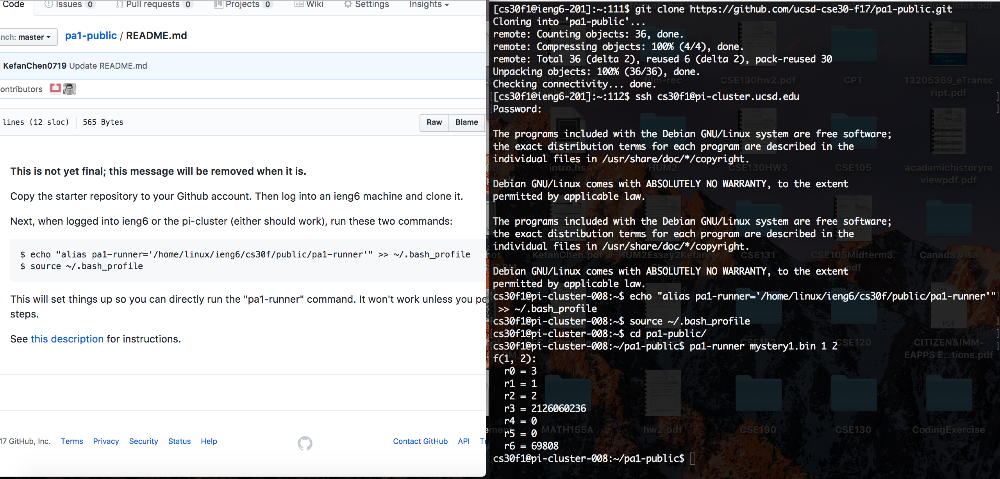

# PA1 – Working with Machine Code

Visit this link, which will copy the starter repository to your Github account:

https://classroom.github.com/a/cT28QuRd

Then log into an ieng6
machine and clone it.

Next, when logged into ieng6 or the pi-cluster (either should work), run these
two commands:

```
$ echo "alias pa1-runner='/home/linux/ieng6/cs30f/public/pa1-runner'" >> ~/.bash_profile
$ source ~/.bash_profile
```



(Note that you will clone your specific repository, not pa1-public)

This will set things up so you can directly run the `pa1-runner` command.
It won't work unless you perform these steps.


See **[this description](./description.pdf)** for instructions on completing the assignment.
